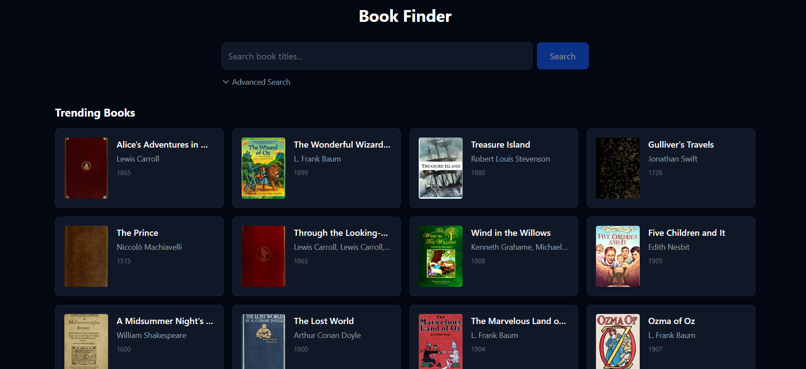
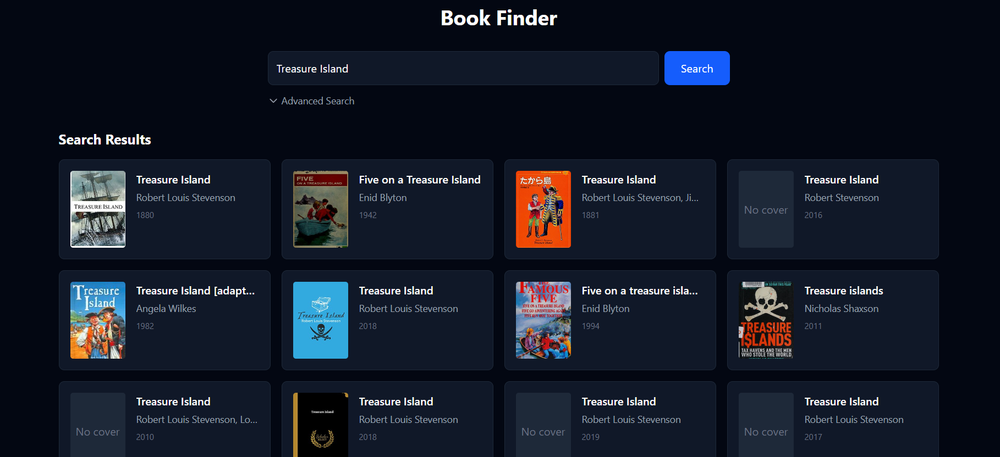

# 📚 Book Finder

A modern, minimal **React + Tailwind** app to discover books from the **Open Library API**.  
Search by title with optional author/ISBN filters or browse trending books right on the homepage.  
Click any book to see full details in a sleek dark-themed modal.

---

## 🔗 Live Demo

[Click here to view the working project](https://book-finder-vivek-rokadi.vercel.app/)

## 📸 Screenshots

### Homepage (Trending Books)

### Search Results

### Book Details Modal

## ✨ Features

- **Trending Books on Homepage**  
  See a curated list of trending books (via Open Library Subjects API) before searching.
- **Search Books**  
  Search by title, with optional author and ISBN filters.
- **Responsive Dark UI**  
  Built with Tailwind CSS dark mode for a modern, minimal look.
- **Book Details Modal**  
  View book cover, author, publication year, description, and subjects.
- **Graceful Loading & Error States**  
  Feedback while fetching data or when no results found.

---

## 🛠 Tech Stack

- **React (Vite)** for the frontend  
- **Tailwind CSS** for styling   
- **Open Library API** for search, trending books, and details  
- **React Hooks** (`useState`, `useEffect`) for state management  

---

